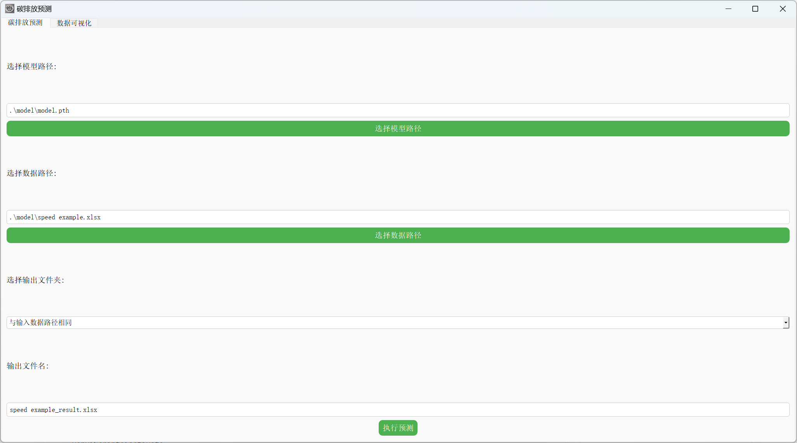
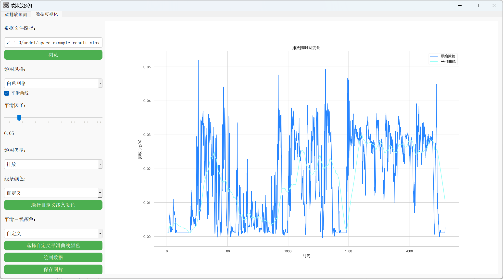

# Carbon Emission Prediction v1.1.0

## 1. Environment Configuration

Before running this project, please ensure that the development environment has been correctly configured. It is recommended to use a virtual environment to isolate project dependencies and ensure consistency with the versions of the project's dependency packages.

### 1.1 Create a Virtual Environment

You can create a virtual environment using `venv` or `conda`. Below is an example of creating a virtual environment using `venv`:

```bash
# Create a virtual environment in the project root directory
python -m venv venv

# Activate the virtual environment
# Windows:
venv\Scripts\activate

# macOS/Linux:
source venv/bin/activate
```

### 1.2 Install Dependencies

The project's dependencies are listed in the `requirements.txt` file. After activating the virtual environment, run the following command to install all dependencies:

```bash
pip install -r requirements.txt
```

If the above method does not work properly, you can also manually install the following dependencies:

```bash
pip install torch # It is recommended to change it to a version of torch compatible with your CUDA version; by default, the installed torch is the CPU version, link (https://pytorch.org/)
pip install PyQt5

pip install numpy
pip install pandas
pip install seaborn
pip install matplotlib
```

### 1.3 Verify Installation

After installation, you can verify that all dependencies have been successfully installed by running the following commands:

```python
import torch
import PyQt5
import numpy
import pandas
import seaborn
import matplotlib
```

If there are no error messages, it indicates that the environment configuration is correct, and you can start running the project code.

## 2. Launching the Program
After configuring all dependencies, you can launch the program through the following steps:
1. Ensure the virtual environment is activated (refer to Section 1.1).
2. Double-click the `Double_Click_Me!.bat` file in the project directory.
3. The `Double_Click_Me!.bat` file has been configured with all commands required to start the program; simply double-click it to easily start the project.

## 3. Data Preparation

Before running the program, make sure you have prepared the data files. The data files should contain the following content:

- Time-series data sampled every 1 second during vehicle operation, with the column name `speed`, unit km/h.
- Sample data is located in the `model` folder, with the filename `speed example.xlsx`.

Ensure the data file format is correct and the column names match the expectations in the program.

---

## 4. User Guide

After launching the program, you will see a graphical user interface (GUI):
<div align=center>
 
</div>
<div align=center>
 
</div>

In this GUI, you can perform the following operations:
### 4.1 Carbon Emission Prediction
1. **Model Import**:
   - Click the "Select Model Path" button to choose a trained model file (usually a `.pth` formatted file).
   - This model file will be loaded into the program for predicting input data.

2. **Data Import**:
   - Click the "Select Data Path" button to choose an Excel file (`xlsx` format) containing the data to be predicted.
   - The program will use this data for carbon emission prediction.

3. **Output Path Setting**:
   - In the "Select Output Folder" section, you can choose the output path for the prediction results.
     - **Same as Input Data Path**: The output results will be saved in the same folder as the input data.
     - **Desktop**: The output results will be saved on the desktop.
     - **Custom Path**: You can select a custom path as the output folder. After selection, the system will automatically update the display of the output path.

4. **Filename Setting**:
   - In the "Output Filename" field, you can modify the name of the output result file. By default, the program will generate an appropriate output filename based on the input data filename.

5. **Execute Prediction**:
   - Click the "Execute Prediction" button, and the program will load the model and predict the input data.
   - After the prediction is complete, the results will be saved as an Excel file and displayed at the specified output path.

6. **Prediction Results**:
   - The prediction results will include the input speed data `speed(km/h)` and corresponding carbon emission prediction values `emission(kg/s)`.
   - The results will be automatically saved as an Excel file, with the filename and path determined according to your settings.

### 4.2 Visualization of Carbon Emission Prediction Results

1. **Switch Interface**:
   - Switch the interface to the 'Data Visualization' screen.

2. **Data File Path Setting**:
   - **Select Data File**:
     - Click the "Browse" button to open the file selection dialog.
     - Choose an Excel file (`xlsx` format) containing the data. After selection, the file path will be displayed in the "Data File Path" input box.

3. **Plot Style Selection**:
   - **Set Plot Style**:
     - Select a style from the "Plot Style" drop-down menu, such as "white grid", "black grid", "black", or "ticks". After selection, the chart style will adjust according to the selected style.

4. **Smooth Curve Settings**:
   - **Display Smooth Curve**:
     - Check or uncheck the "Smooth Curve" checkbox to choose whether to display a smooth curve in the chart.
   - **Set Smoothing Factor**:
     - Use the "Smoothing Factor" slider to adjust the smoothing factor. The value of the smoothing factor will be shown in the label next to the slider. The default value is 0.05, ranging from 0.01 to 0.30.

5. **Plot Type Selection**:
   - **Select Plot Type**:
     - Choose a plot type from the "Plot Type" drop-down menu, such as "Emission", "Speed", "Cumulative Speed", or "Cumulative Emission". Based on the selected type, the chart will display different data contents.

6. **Line Color Setting**:
     - Select a color from the "Line Color" drop-down menu. If "Custom" is selected, click the "Select Custom Line Color" button to open the color selection dialog and choose the desired custom color.

7. **Smooth Curve Color Setting**:
    - Select a color from the "Smooth Curve Color" drop-down menu. If "Custom" is selected, click the "Select Custom Smooth Curve Color" button to open the color selection dialog and choose the desired custom color.

8. **Draw Data**:
   - Click the "Draw Data" button, and the application will draw the data chart based on the set parameters. The chart will be displayed in the right area of the application.

9. **Save Chart**:
    - Click the "Save Image" button to open the file save dialog.
    - Choose a save path and filename, and save the chart as a PNG image file (`png`).

## 5. Exit the Application:

Close the application window to terminate script execution and exit the application.

# 碳排放预测v1.1.0

## 1. 环境配置

在运行本项目之前，请确保已经正确配置了开发环境。推荐使用虚拟环境来隔离项目依赖，并确保与项目的依赖包版本一致。

### 1.1 创建虚拟环境

您可以使用 `venv` 或 `conda` 来创建虚拟环境。以下是使用 `venv` 创建虚拟环境的示例：

```bash
# 在项目根目录下创建虚拟环境
python -m venv venv

# 激活虚拟环境
# Windows:
venv\Scripts\activate

# macOS/Linux:
source venv/bin/activate
```

### 1.2 安装依赖包

项目的依赖包已经列在 `requirements.txt` 文件中。请在激活虚拟环境后，运行以下命令来安装所有依赖包：

```bash
pip install -r requirements.txt
```

如果上述方法无法正常运行，也可以手动安装以下依赖包：

```bash
pip install torch # 建议更改为适配你的CUDA版本的torch，默认安装的torch是cpu版本，链接(https://pytorch.org/)
pip install PyQt5

pip install numpy
pip install pandas
pip install seaborn
pip install matplotlib
```

### 1.3 验证安装

安装完成后，您可以通过运行以下命令来验证所有依赖包是否成功安装：

```python
import torch
import PyQt5
import numpy
import pandas
import seaborn
import matplotlib
```

如果没有错误提示，说明环境配置正确，您可以开始运行项目代码。

## 2. 启动程序 
在完成所有依赖包的配置之后，您可以通过以下步骤启动程序： 
1. 确保已激活虚拟环境（参见第1.1节）。 
2. 双击项目目录下的 `双击我！.bat` 文件。
3.  `双击我！.bat` 文件已经配置好所有启动程序所需的命令，您只需双击即可轻松启动项目。

## 3. 数据准备

在运行程序之前，请确保您已经准备好数据文件。数据文件应该包含以下内容：

- 列名为`speed`的车辆运行过程中每1s采样的时序数据，单位km/h。
- 示例数据在`model`文件夹中，文件名为`speed example.xlsx`。

请确保数据文件格式正确，并且列名与程序中的预期一致。

---

## 4. 使用说明

程序启动后，您将看到一个图形用户界面（GUI）:
<div align=center>
 
</div>
<div align=center>
 
</div>

在该GUI中，您可以进行以下操作：
### 4.1 碳排放预测
1. **模型导入**：
   - 点击“选择模型路径”按钮，选择已经训练好的模型文件（通常是 `.pth` 格式的文件）。
   - 该模型文件将被加载到程序中，用于对输入数据进行预测。

2. **数据导入**：
   - 点击“选择数据路径”按钮，选择包含需要预测数据的 Excel 文件（`.xlsx` 格式）。
   - 程序将使用该数据进行碳排放预测。

3. **输出路径设置**：
   - 在“选择输出文件夹”部分，您可以选择预测结果的输出路径。
     - **与输入数据路径相同**：输出结果将保存到与输入数据相同的文件夹中。
     - **桌面**：输出结果将保存到桌面。
     - **自定义路径**：您可以选择自定义路径作为输出文件夹。选择后，系统会自动更新输出路径显示。

4. **文件名设置**：
   - 在“输出文件名”栏中，您可以修改输出结果文件的名称。默认情况下，程序会根据输入数据文件名自动生成一个合适的输出文件名。

5. **执行预测**：
   - 点击“执行预测”按钮，程序将加载模型并对输入数据进行预测。
   - 预测完成后，结果将保存为 Excel 文件，并显示在指定的输出路径中。

6. **预测结果**：
   - 预测的结果将包括输入的速度数据 `speed(km/h)` 和相应的碳排放预测值 `emission(kg/s)`。
   - 结果将被自动保存为 Excel 文件，文件名和路径依据您的设置确定。

### 4.2 碳排放预测结果可视化

1. **切换界面**：
   - 将界面切换至'数据可视化'界面。

2. **数据文件路径设置**：
   - **选择数据文件**：
     - 点击“浏览”按钮，打开文件选择对话框。
     - 选择包含数据的 Excel 文件（`.xlsx` 格式）。选择后，文件路径将显示在“数据文件路径”输入框中。

3. **绘图风格选择**：
   - **设置绘图风格**：
     - 从“绘图风格”下拉菜单中选择一个风格，如“白色网格”、“黑色网格”、“黑色”或“刻度”。选择后，图表的样式将根据所选风格进行调整。

4. **平滑曲线设置**：
   - **显示平滑曲线**：
     - 勾选或取消勾选“平滑曲线”复选框，选择是否在图表中显示平滑曲线。
   - **设置平滑因子**：
     - 使用“平滑因子”滑动条调整平滑因子。平滑因子的值将在滑动条旁边的标签中显示。默认值为0.05，范围从0.01到0.30。

5. **绘图类型选择**：
   - **选择绘图类型**：
     - 从“绘图类型”下拉菜单中选择绘图类型，如“排放”、“车速”、“车速累积”或“排放累积”。根据选择的类型，图表将显示不同的数据内容。

6. **线条颜色设置**：
     - 从“线条颜色”下拉菜单中选择一种颜色。如果选择“自定义”，点击“选择自定义线条颜色”按钮打开颜色选择对话框，选择所需的自定义颜色。

7. **平滑曲线颜色设置**：
    - 从“平滑曲线颜色”下拉菜单中选择一种颜色。如果选择“自定义”，点击“选择自定义平滑曲线颜色”按钮打开颜色选择对话框，选择所需的自定义颜色。

8. **绘制数据**：
   - 点击“绘制数据”按钮，应用程序将根据设置的参数绘制数据图表。图表将显示在应用程序的右侧区域。

9. **保存图表**：
    - 点击“保存图片”按钮，打开文件保存对话框。
    - 选择保存路径和文件名，将图表保存为 PNG 格式的图片（`.png`）。

## 5. 退出应用程序：

关闭应用程序窗口终止脚本执行，退出应用程序。
